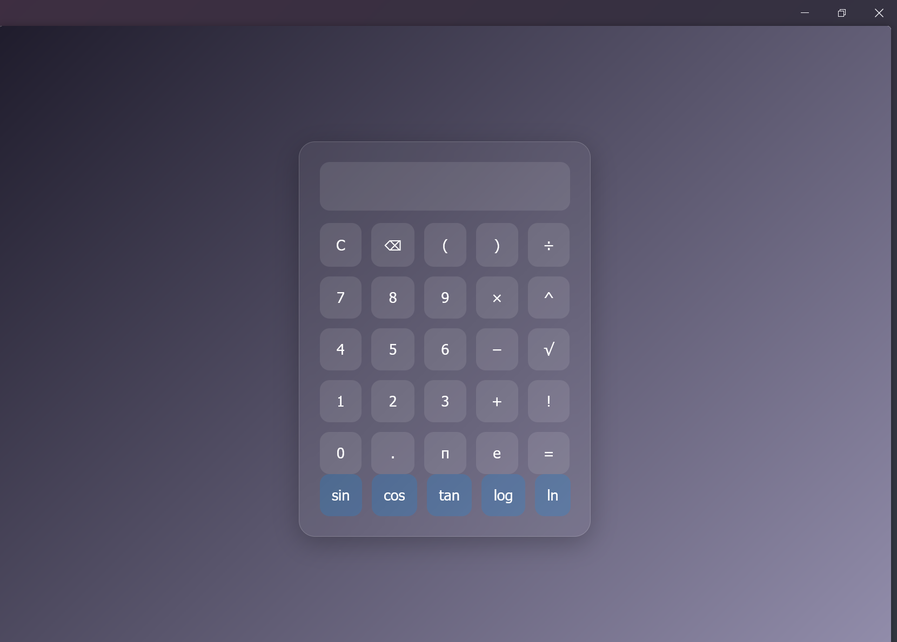

# 🔢 Calculator App 😁

> A simple yet powerful calculator that supports both **basic arithmetic operations** and **scientific calculations** like trigonometry, logarithms, factorials, and more!

This is a sleek, responsive calculator built with **HTML**, **CSS**, and **JavaScript** (with `math.js`). Whether you're solving basic math or diving into complex equations, this calculator has got you covered.

---

## 🧰 Features

✅ Basic Operations: `+`, `-`, `×`, `÷`  
✅ Scientific Functions:  
- Trigonometric: `sin`, `cos`, `tan`  
- Logarithmic: `log`, `ln`  
- Powers & Roots: `^`, `sqrt`  
- Factorials: `5!`  
- Constants: `π`, `e`  

✅ Keyboard Support  
✅ Responsive Design  
✅ Glassmorphic Dark Theme  
✅ Safe expression evaluation using `math.js`

---

## 🛠️ Technologies Used

- **HTML5** – Semantic structure
- **CSS3** – Glassmorphism design, animations
- **JavaScript (Vanilla + math.js)** – Logic and scientific evaluation
- **math.js** – For secure and accurate mathematical parsing

---

